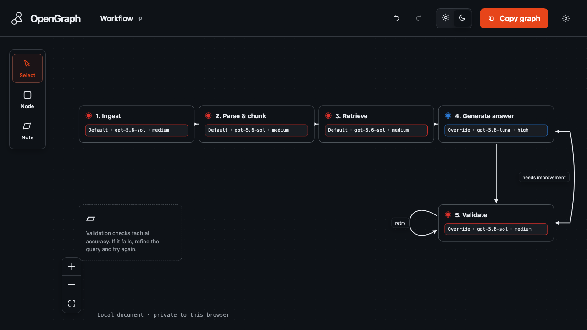

# OpenGraph

OpenGraph is a free, frontend-only visual workflow editor for developers. Build a graph with draggable nodes, annotations, directed or bidirectional edges, and loops; assign model and reasoning defaults; then copy the graph as a PNG. An optional local MCP companion lets Codex design the same graph conversationally.



Standalone mode stays entirely in the browser. Codex mode adds only a temporary process on your own computer; there is still no login, cloud backend, account, or remote synchronization.

## Run locally

```bash
npm install
npm run dev
```

Open the local URL shown by Vite.

## Main interactions

- Drag **Node** or **Note** from the tool rail onto the canvas.
- Double-click the canvas to create a workflow node.
- Drag between node handles to create a directed edge.
- Select a node and use **Connect from this node** for the accessible connection flow.
- Select an edge to switch between directed, bidirectional, and loop behavior.
- Open model settings to enable models and choose global defaults.
- Let nodes inherit defaults or override model and reasoning individually.
- Use `Cmd/Ctrl + Z` and `Cmd/Ctrl + Shift + Z` for undo and redo.
- Select an item and press `Delete`; use `Cmd/Ctrl + D` to duplicate a node.
- Press **Copy graph** to copy a clean PNG. If image clipboard access is unavailable, OpenGraph offers an explicit download.

The current graph is stored in `localStorage` and restored on reload.

## Codex mode (optional)

The companion uses stable v1 of `@modelcontextprotocol/sdk` over local STDIO. It starts a temporary HTTP/WebSocket session on `127.0.0.1`, authenticates the browser with a high-entropy per-process token in the URL fragment, and closes everything when the process stops. The HTTP server accepts only the assigned loopback `Host`, the exact loopback `Origin`, `GET`/`HEAD`, and safe paths below `dist/`.

Build the web app and companion, then run the companion from the project root:

```bash
npm run build
npm run companion
```

For Codex, add the project-local MCP entry in `.codex/config.toml` or use the equivalent project MCP settings:

```toml
[mcp_servers.opengraph]
command = "npm"
args = ["run", "--silent", "companion"]
startup_timeout_sec = 20
```

The seven tools are:

- `open_opengraph` — start the local session and return its URL.
- `get_graph` — read the normalized document and revision.
- `get_active_context` — read selection, active tool, name, viewport, and revision.
- `apply_graph_operations` — apply an atomic batch; `baseRevision` is required.
- `layout_graph` — apply a deterministic horizontal or vertical layout; `baseRevision` is required.
- `undo` — undo exactly one confirmed transaction; `baseRevision` is required.
- `render_graph` — return the visible graph as a PNG generated through the canvas ref.

Example conversation:

> Open OpenGraph. Add a `Validate` node using `gpt-5.6-sol` with medium reasoning, connect it back to `Generate answer` with a loop labeled `retry`, and then lay out the graph to the right.

If the browser is closed, graph-dependent tools return an explicit `NO_UI` error. If another local edit changes the revision, a stale operation returns `REVISION_CONFLICT` and makes no partial change.

## Verification

```bash
npm run build
npm test
npm run test:coverage
npm run test:e2e
npm run smoke:mcp
```

The critical non-UI modules are held to 100% statements, branches, functions, and lines. Playwright covers the primary browser workflows in Chromium.

## Deployment

Production is declared in [`infra/main.bicep`](infra/main.bicep) as an Azure Static Web App on the Free SKU. GitHub Actions builds and deploys every push to `main`; pull requests receive temporary preview environments.

To reproduce the Azure resource and configure the repository deployment token:

```bash
./scripts/bootstrap-azure.sh
```

The defaults target resource group `rg-opengraph-prod`, site `opengraph-web-prod`, region `westus2`, and repository `clioo/opengraph`. Override them with `AZURE_RESOURCE_GROUP`, `AZURE_STATIC_SITE_NAME`, `AZURE_LOCATION`, and `GITHUB_REPOSITORY` environment variables. The deployment token is written directly to GitHub Actions secrets and is never stored in the repository.

Production uses `www.opengraph.work` as its canonical hostname. Squarespace DNS keeps DNSSEC enabled, points `www` to the Azure-generated hostname with a CNAME, and permanently forwards the apex `opengraph.work` to `www` while preserving paths. Domain Connect and email-security records remain untouched.

## Stack

- React, TypeScript, and Vite
- React Flow
- Zustand
- html-to-image
- `@modelcontextprotocol/sdk` v1.29.0, Zod, and ws for the optional local companion
- Vitest and Playwright
